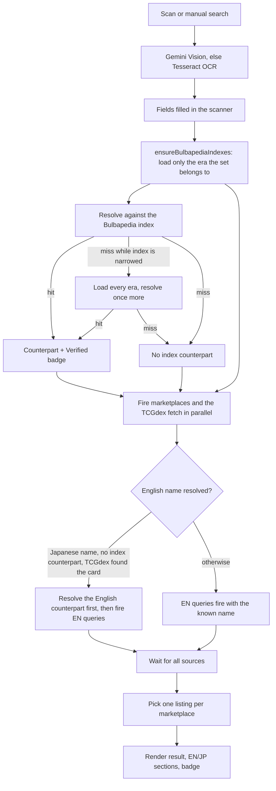
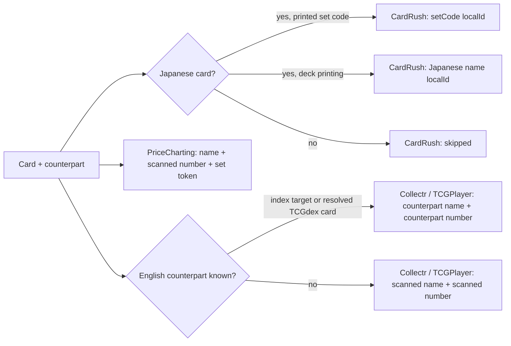
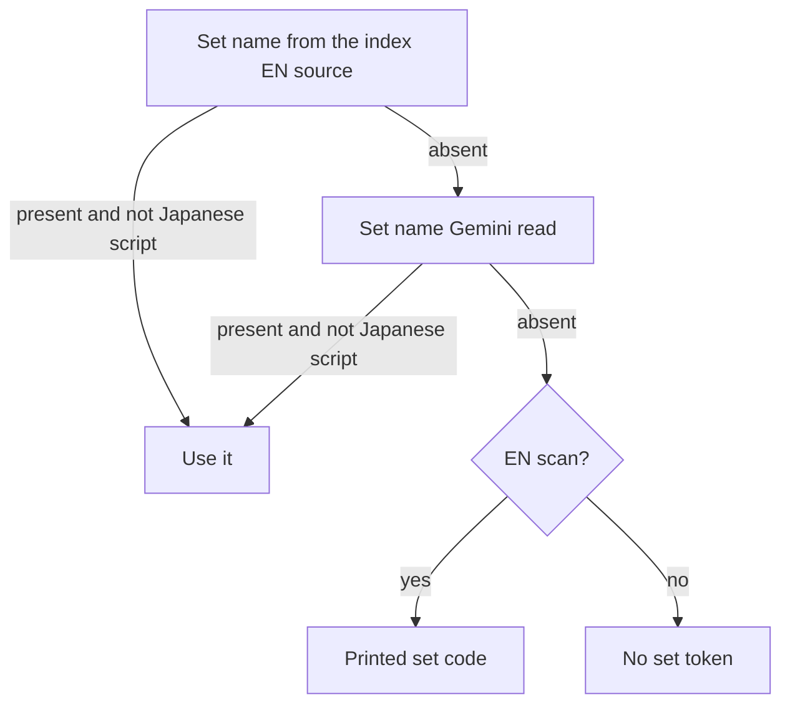
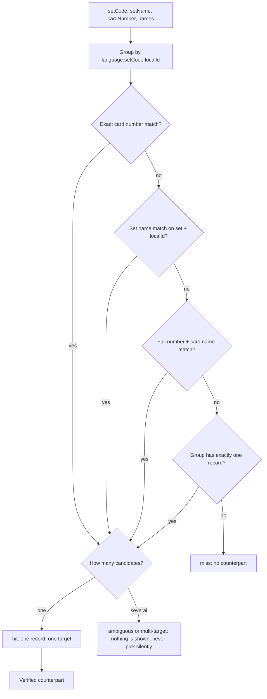
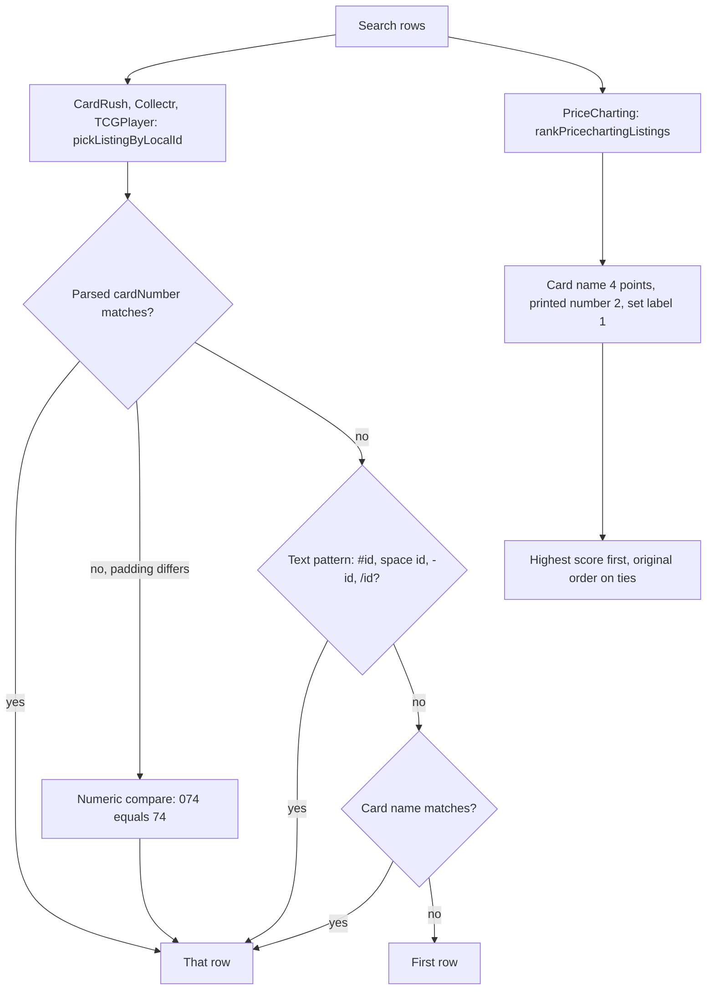
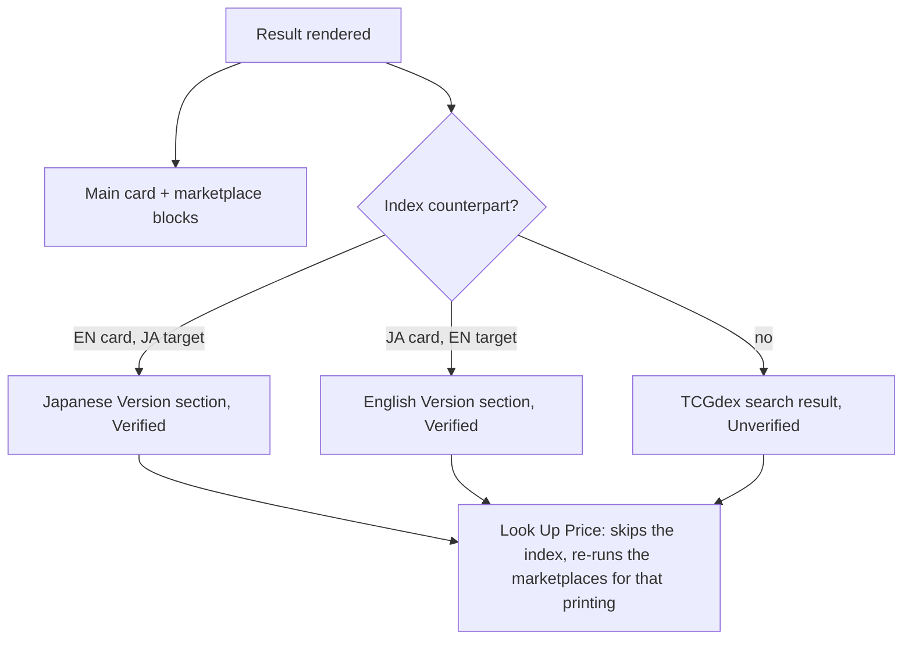

# Search Logic — Visual Reference

How a scan becomes four marketplace queries and one picked listing. The normative rules live in
[`APP_DOCUMENTATION.md` §7](APP_DOCUMENTATION.md#7-marketplace-search-query-logic) and §12; this file is the map.

Diagrams are Mermaid (they render on GitHub). Each one also has an ASCII version, so the file stays readable in a
plain editor.

---

## 1. End-to-end flow



```text
scan/manual ─► Gemini|Tesseract ─► fields ─► ensureBulbapediaIndexes(era) ─► resolve
                                                     │ hit ─► counterpart (Verified)
                                                     │ miss ─► load all eras, retry once ─► miss = no counterpart
                                                     ▼
        fire in parallel: CardRush(JP only) + PriceCharting + Collectr + TCGPlayer + TCGdex fetch
                                                     │
                        Japanese name with no index counterpart? ─► resolve EN card first (C5)
                                                     ▼
                     wait for all ─► pick listing per marketplace ─► render (+ badge)
```

Two properties worth remembering:

- The marketplaces are the slow part, so they normally start together with the TCGdex fetch (§6.4 of the application
  documentation) and its result only refines later steps. The exception is the C5 path: when the name was read in
  Japanese and the index has no counterpart, the three EN queries wait until the English printing is resolved,
  because they must not be searched with a Japanese name.
- The index is the only source that can mark a counterpart **Verified**; a TCGdex search result is **Unverified**.

---

## 2. Which query each marketplace gets



| Case | CardRush | PriceCharting | Collectr / TCGPlayer |
|---|---|---|---|
| Normal EN card | skipped | `{EN name} {number}/{total} {set token}` | `{EN name} {number}/{total}` |
| Normal JP card | `{set code} {localId}` | `{EN name} {JP number}/{total} {set token}` | counterpart name + number |
| Promo | `{set code} {localId}` | `{EN name} {localId}` | `{EN name} {localId}` |
| Deck printing (no printed code) | `{Japanese name} {localId}` | `{EN name} {number}/{total}` | same as normal |
| JP card, no counterpart found | `{set code} {localId}` | `{EN name} {JP number}/{total} {set token}` | scanned name + scanned number |

Set token for PriceCharting (`pickPricechartingSetToken`), first match wins:



---

## 3. Index resolution



The last question is the tolerance for a wrong printed total: it only applies when a single record is left, so it can
never override a better match.

Why the total exists at all: paired Japanese products reuse the same printed code and number (`BW1` is both White
Collection `001/053` and Black Collection `001/055`), so the total separates them. It is only skipped when a single
record is left, which is how a Bulbapedia row with a wrong total stays reachable.

A card printed with an abbreviation the index does not store still resolves: the group index also holds each
record's source-side TCGdex set id, and the caller passes the printed code resolved through the abbreviation table
in `utils/constants.js` as an alias, so `JTG` finds the record stored as `SV09`. A manual search with no language
hint is treated as English when the set code is a known EN abbreviation.

---

## 4. Picking the listing



The name step is what keeps a sold-out card honest. CardRush's search is fuzzy: `S8b 110` returned 23 different
numbers with `204/184` first, so a number-only match would show another card's price whenever the wanted printing
is gone. The name passed in is the one the query used — the Japanese name for CardRush, the counterpart's English
name for Collectr and TCGPlayer — and it is compared after normalization (NFKC, lowercase, no trailing
`EX`/`GX`/`VMAX`/`VSTAR`, no spaces), accepting an exact match or a containment match of at least four characters.

The row that wins is also the row PriceCharting enriches from its detail page, so the score decides both the shown
price and the extra sale/grade data.

---

## 5. Cross-version sections and their buttons



- The JP section's button carries the printing's set code, number, Japanese name and the `printsNoSetCode` flag,
  because that flow does not touch the index.
- `shouldSkipJpTcgdexLookup` skips the guaranteed-to-fail TCGdex fetch when the printing came from the index and
  TCGdex has no Japanese card for that set.

---

## 6. Where each rule lives

| Rule | File |
|---|---|
| Query construction, EN counterpart resolution, listing selection, badge | `utils/card-lookup.js` |
| Index resolution (`hit` / `ambiguous` / `multi-target` / `miss`) | `lib/bulbapedia-resolver.js` |
| Lazy per-era loading and the all-era retry | `lib/bulbapedia-index.js` |
| TCGdex lookup, set mapping, cross-version search | `lib/tcgdex-client.js` |
| PriceCharting row ranking and detail enrichment | `lib/pricecharting-scraper.js` |
| Marketplace DOM extraction | `content-scripts/*-extractor.js` |
| Reviewed index data and per-era exclusions | `data/bulbapedia/<era>/` |
